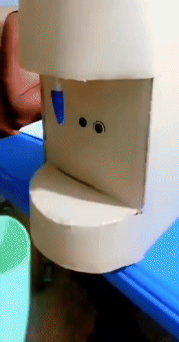

# 🚰 Automatic Touchless Water Dispenser

A hands-free water dispenser built with an Arduino Uno and an ultrasonic sensor. Bring your hand or a cup close to it, water flows automatically. Move it away, water stops. No buttons, no handles, no contact.

*The prototype above was built as a group project in my third year of undergrad (2023) — a low-cost cardboard housing around the working electronics.*

---

## Why this project

Regular taps and dispensers need to be touched, which spreads germs between users. This project removes that point of contact using a distance sensor: the device "sees" that something is nearby and turns the pump on for as long as it's there.

## How it works (in plain terms)

1. An **ultrasonic sensor** (like a tiny sonar) sends out a sound pulse and times how long it takes to bounce back off whatever is in front of it.
2. The **Arduino** turns that time into a distance, in centimeters.
3. If something stays within range (about 2–10 cm) for a few readings in a row — not just one, to avoid false triggers — the Arduino switches on a **relay**, which acts like a remote-controlled switch.
4. The relay turns on a small **water pump**, and water flows through a tube to the nozzle.
5. As soon as the object moves away, the pump switches off immediately.
6. As a safety measure, if something is left in front of the sensor too long, the pump shuts itself off automatically after 8 seconds, so it can't run forever by accident.

## What's in this repository

| Folder / File | What it is |
|---|---|
| [`firmware/touchless_water_dispenser.ino`](firmware/touchless_water_dispenser.ino) | The full Arduino code, ready to upload |
| [`docs/circuit_diagram.png`](docs/circuit_diagram.png) | Wiring diagram — how every component connects |
| [`docs/Project_Report.pdf`](docs/Project_Report.pdf) | Full write-up: background, related work, parts list, wiring, code walkthrough, and testing notes |
| [`media/`](media) | Photos and a short clip of the original 2023 build in action |

## Parts used

- Arduino Uno
- HC-SR04 ultrasonic distance sensor
- 1-channel 5V relay module
- Small DC water pump (5–12V)
- Tubing + water reservoir
- 9–12V power supply for the pump
- (Optional) status LED

Full wiring, including which Arduino pin connects to what, is in the [circuit diagram](docs/circuit_diagram.png) and explained pin-by-pin in the [project report](docs/Project_Report.pdf).

## Try it without any hardware

You can run and test the exact code in this repo for free, with no parts needed, using [Wokwi](https://wokwi.com) — an in-browser Arduino simulator that supports the Uno and the HC-SR04 sensor. Paste in the `.ino` file, drag the sensor's distance slider, and watch it respond.

## Possible next steps

- Add a flow sensor to dispense an exact amount (e.g., always 100 mL) instead of running for as long as an object is in range
- Add an LCD to show status to the user
- Swap the Arduino for an ESP32 to log usage data over Wi-Fi
- Auto-calibrate the activation distance instead of using a fixed range

## Author

**Adu-Gyamfi Kwadwo** — B.Sc. Electrical/Electronic Engineering, Kwame Nkrumah University of Science and Technology (KNUST)
